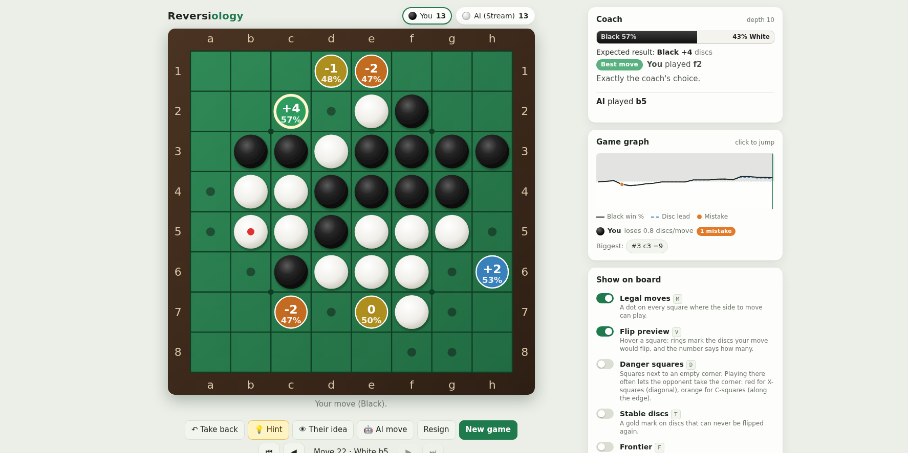

# Reversiology

Learn Reversi by playing. An AI opponent from beginner to superhuman, and a
coach that grades every move, explains it, and shows you what it would have
played.

## ▶ [Play Reversiology in your browser](https://killedbyapixel.github.io/Reversiology/)

## What you get

- **An opponent at your level.** Nine levels from Pebble to Phoenix, plus
  handicap corners. Play Black, White, or both sides.
- **A coach for every move.** A grade and a plain reason: a corner given
  away, a risky square, too many moves left for your opponent. It talks to
  beginners about corners and safe discs, and to stronger players about
  mobility, frontier and parity.
- **Perfect endgames.** In the last moves the coach works the game out exactly
  and tells you who wins, and by how much.
- **Puzzles.** 156 positions from real games where one move is clearly best,
  from easy to hard, each with a hint and an explanation.
- **Openings.** The coach names the opening you're in: Tiger, Rose, Buffalo
  and 70 more.
- **See what strong players see.** Legal moves, a flip preview, danger
  squares next to empty corners, stable discs and more, right on the board.
- **Take back anything.** Try other moves and review your games on a graph
  with your mistakes marked.
- **Play by keyboard or by ear.** Full keyboard play, screen reader support
  and optional spoken announcements.

The rules and a short guide to strategy are in the game itself.

## How strong is it?

Pebble plays almost at random. Each level beats the one below it about 7 to 9
games out of 10. Phoenix, the strongest, reads 22 moves ahead and plays the
last 22 perfectly, in about a second a move. Against
[Edax](https://github.com/abulmo/edax-reversi), one of the strongest Reversi
programs, it held its own at Edax's strong settings: 14 wins, 5 losses and a
draw at level 12, and about even at levels 16, 18 and 21 (level 21 reads 21
moves ahead and plays the last 24 perfectly). That is far beyond any human
player.

© 2026 Frank Force. Free and open source under the [GPL-3.0 license](LICENSE).
The AI uses evaluation weights from [Edax](https://github.com/abulmo/edax-reversi)
by Richard Delorme. Opening names come from
[Egaroucid](https://github.com/Nyanyan/Egaroucid)'s list, after the Othello
opening list by Robert Gatliff and others.
